# Neural Network Charity Analysis

## Overview
We received a CSV containing more than 34,000 organizations from Alphabet Soup’s business team, that have received funding from Alphabet Soup over the years. Within this dataset are a number of columns that capture metadata about each organization. Using machine learning and neural networks, we’ll use the features in the provided dataset to help Beks create a binary classifier that is capable of predicting whether applicants will be successful if funded by Alphabet Soup.

### Features

Feature|Description         
-------|-----------
EIN and NAME  |  Identification columns
APPLICATION_TYPE  |  Alphabet Soup application type
AFFILIATION  |  Affiliated sector of industry
CLASSIFICATION  |  Government organization classification
USE_CASE  |  Use case for funding
ORGANIZATION  |  Organization type
STATUS  |  Active status
INCOME_AMT  |  Income classification
SPECIAL_CONSIDERATIONS  |  Special consideration for application
ASK_AMT  | Funding amount requested
IS_SUCCESSFUL |  Was the money used effectively

## Resources
  - Data Source: charity_data.csv
  - Software: anaconda3, python 3.7.7, jupyter notebook
  - Librarys: pandas, sklearn.model_selection (train_test_split), sklearn.preprocessin (StandardScaler,OneHotEncoder), tensorflow, os, tensorflow.keras.callbacks (ModelCheckpoint)

## Results

### Preprocessing Data for a Neural Network Model

#### Target for the model
Feature 'IS_SUCCESSFUL' is considered the target for the model.

#### Features for the model
All other features except 'EIN' and 'NAME' are considered as features for this model

#### Removed from the input data
Features 'EIN', 'NAME', and 'IS_SUCCESSFUL' are removed from the input data.

### Compile, Train, and Evaluate the Model
  - Model 0 
    
    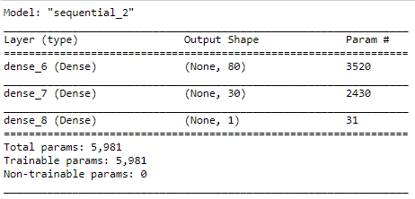
    
  - Train stats
    
    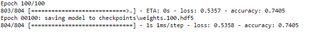
    
  - Test stats
    
    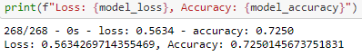
    
  - Results
    
    Required accuracy of > 75% was not achieved with this model.
    

### Optimize the Model
Three different models were created for optimizing the model 0 to get accuracy to go > 75%.

#### Model 1 Target
Feature 'IS_SUCCESSFUL' is considered the target for the model.

#### Model 1 Features 
 - All other features except 'EIN' are considered as features for this model
 - ASK_AMT is converted to string and binned into 5000 and other bins
 - NAME is binned into counts < 12
 - model run for 100 epochs
 - nodes in layer 1 = number of input features * 2

#### Model 1 features removed from the input data
Features 'EIN', 'STATUS', and 'IS_SUCCESSFUL' are removed from the input data.

#### Compile, Train, and Evaluate the Model
  - Model 1 
    
    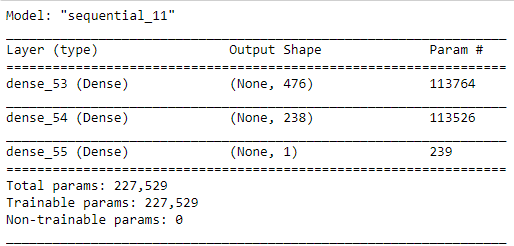
    
  - Train stats
    
    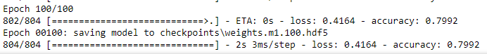
    
  - Test stats
    
    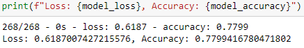
    
  - Results
    
    Required accuracy of > 75% was achieved but loss > 60%.
    

#### Model 2 Target
Feature 'IS_SUCCESSFUL' is considered the target for the model.

#### Model 2 Features 
 - All other features except 'EIN' are considered as features for this model
 - ASK_AMT is converted to string and binned into 5000 and other bins
 - NAME is binned into counts < 12
 - model run for 100 epochs
 - 4 layers in the model
 - nodes in layer 1 = number of input features * 2

#### Model 2 features removed from the input data
Features 'EIN', and 'IS_SUCCESSFUL' are removed from the input data.

#### Compile, Train, and Evaluate the Model
  - Model 2
    
    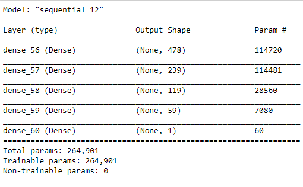
    
  - Train stats
    
    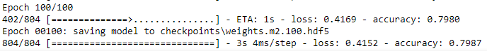
    
  - Test stats
    
    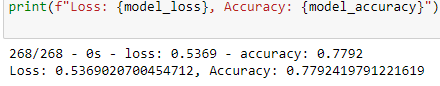
    
  - Results
    
    Required accuracy of > 75% was achieved but loss > 50%.
    

#### Model 3 Target
Feature 'IS_SUCCESSFUL' is considered the target for the model.

#### Model 3 Features 
 - All other features except 'EIN' are considered as features for this model
 - ASK_AMT is converted to string and binned into 5000 and other bins
 - NAME is binned into counts < 12
 - model run for 50 epochs
 - 4 layers in the model
 - nodes in layer 1 = number of input features * 2

#### Model 3 features removed from the input data
Features 'EIN', and 'IS_SUCCESSFUL' are removed from the input data.

#### Compile, Train, and Evaluate the Model
  - Model 3 
    
    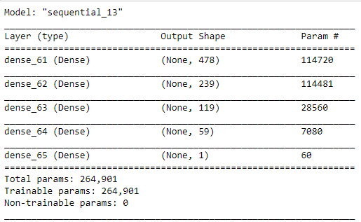
    
  - Train stats
    
    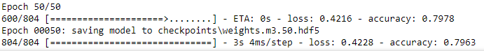
    
  - Test stats
    
    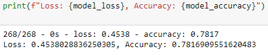
    
  - Results
    
    Required accuracy of > 75% was achieved and loss < 50%.
    

## Summary

Model|Accuracy|Loss|Layers
-----|--------|----|------
 0| 72.5% | 56.34% | 2
 1| 77.99% | 61.87% | 2
 2| 77.92% | 53.69% | 4
 3| 78.17% | 45.38% | 4

Based on the summary of results shown above we can recommend using a model that has 3 or 4 hidden layers and uses all features for input data. Since by adding 'NAME' feature that was discarded in model0 the accuracy % jumped from 72% - 77%. Also having more layers has decreased the loss %. Further trail and error can be used in finding out what other features could be dropped.
